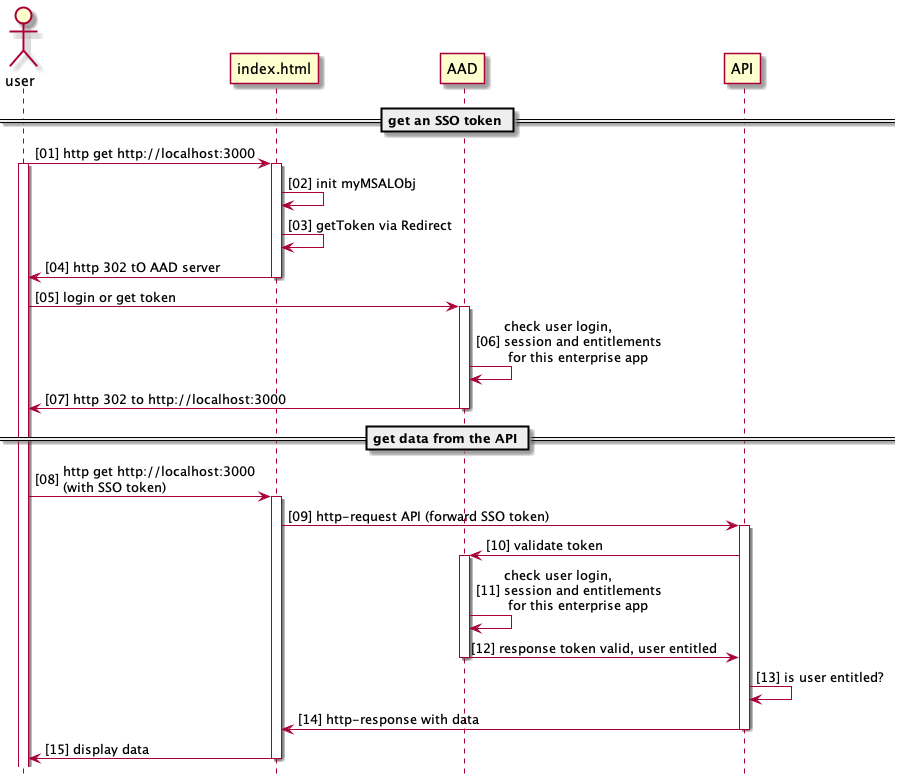
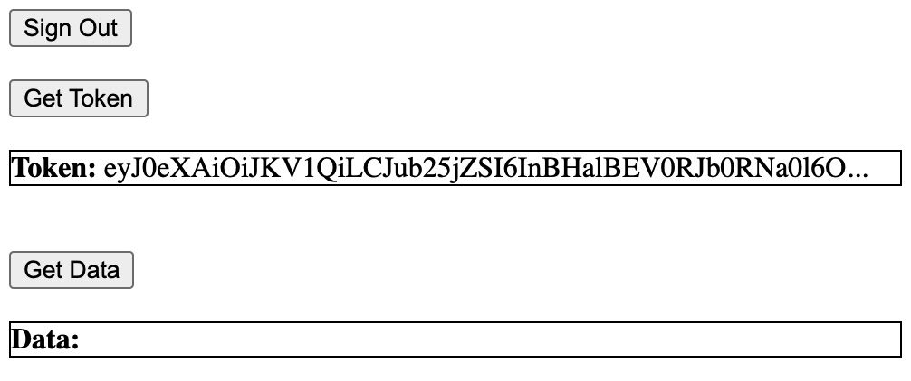
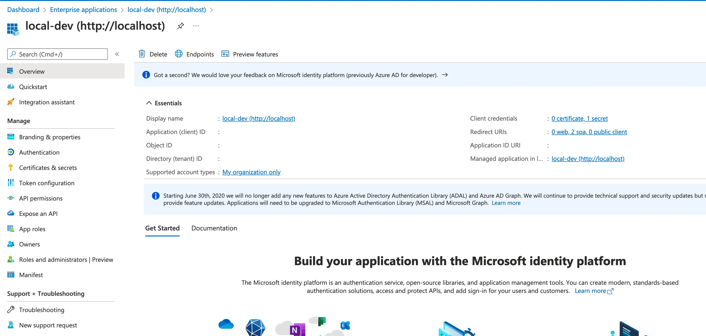
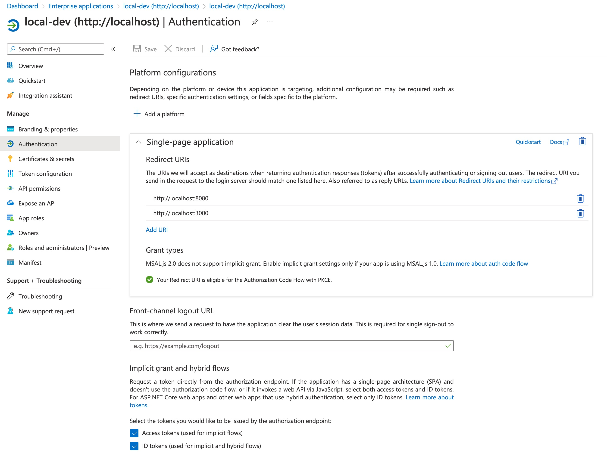

# AAD-SSO
An JS-Frontend and Node.js Backend hat allows log-in via MS Azue Active Directory SSO


The whole flow is as follows



## Setup the node.js app and run

1. You have to install all node modules via `npm i`
2. Afterwards start the node server in debug/develop mode: `nodemon server.js`
3. read the whole doc, setup AAD and enter the right tenant and application IDs to the code.
4. tart your browser on http://localhost:3000 and you'll see something like




## Setup Azure Active Directory

1. Configure an enterprise app and SSO for it


2. Do not forget to configure the redirect URLs properly


## Dependencies

We're using three libs. 2 from Microsoft and 1 from npm repo
``` json
"@azure/msal-browser": "^2.21.0",
"@azure/msal-node": "^1.5.0",
"validate-azure-ad-token": "^1.0.1",
```

## index.hml

### masl configuration

You need two infos from above
* your tenant ID for your MS AD company setup
* the application ID (aka client id) of your enterprise app (see screen 1)

```js
const msalConfig = {
  auth: {
    clientId: "<<application ID>>",
    authority: "https://login.microsoftonline.com/<<tenant ID>>",
    redirectUri: "http://localhost:3000",
  },
  cache: {
    cacheLocation: "sessionStorage",
    storeAuthStateInCookie: false,
  }
}
```

Important for the understanding of the whole flow is the scopes we ask the token to be valid for... In our case it's just `openid` wich is the login and nothing more.
```js
var loginRequest = {
  scopes: ["openid"]
}
```

### get the token

The whole magic is inside the `function getTokenRedirect()`

If the `username` var is not filled, the user is not yet logged in. Simple trick, but it does the job.

```js
  if(username=="") {
    signIn()
  }
```

see above
```js
  const tokenRequest = {
    scopes: ["openid"]
  }
```

read the username from the SSO context
```js
  tokenRequest.account = myMSALObj.getAccountByUsername(username)
```

try to get the token "silent". If the user is already logged in at the AAD, the user will go through a bunch of redirects but will never see a login mask...
```js
  return myMSALObj.acquireTokenSilent(tokenRequest)
    .then(token => {
      ...
      return token.accessToken
    })
```

If that fails, you start the redirect flow where the user sees the login mask of AAD.
The login (inkl. all screens) is handled by AAD.
```js
    .catch(error => {
      if (error instanceof msal.InteractionRequiredAuthError) {
        return myMSALObj.acquireTokenRedirect(request)
      } else {
        console.warn(error)
      }
    })
```

### auto login

It seems the there is (at least) one async function in the MS lib that does not await the result or return a promise. Hence, I have to wait 1.5 seconds. Don't ask my why 1.5 seconds - I just played around with the times until I got the shortest time it worked with...

```js
setTimeout(() => {
  console.debug("wait 1.5 sec before auto login")
  //I don't know why the hell I have to wait 1.5 sec... ask Bill Gates ;-)
  getTokenRedirect()
}, 1500)
```


### get the Data

Adding the token to the http request you sent to the API

```js
  axios.get("http://localhost:3000/protected", {
    headers: {
      "Accept": "application/json",
      "Authorization": "Bearer "+accessToken
    },
  })
```


## Server API

On server side it's tricky as well. Especially the config for the MSAL was tricky and it took me hours to find out. At the end https://jwt.ms/ helped to descrypt the token and read the required "audience" id...

### read the token
read the SSO token from the http request. As you need the value, remove the "bearer " part at the beginning.

```js
  app.get("/protected", (req, res) => {
    var reqToken = (req.headers.authorization)?req.headers.authorization.split(' ')[1]:""
    ...
  }
```

### validate token

instanciate the lib

```js
const validate = require('validate-azure-ad-token').default
...
```
Again you need your tenant and application ID. The tricy part was to find the audience ID to use. For login (= `scopes: ["openid"]`) you have to use `audience: '00000003-0000-0000-c000-000000000000'`

```js
validate(reqToken, {
    tenantId: '<<tenant ID>>',
    audience: '00000003-0000-0000-c000-000000000000',
    applicationId: '<<application id>>',
    scopes: ["openid"]
  })
```

the rest is pretty straight forward. In case of success return the data. In case of an error the token is not valid (invalid in general, timed out, the user is not entitled for this app, ...)

```js
  .then(decodedToken => {
    res.status(200).json({ message: "This message ..." })
  })
  .catch (error => {
    res.status(401).json({err:"not authorised"})
  })
```
